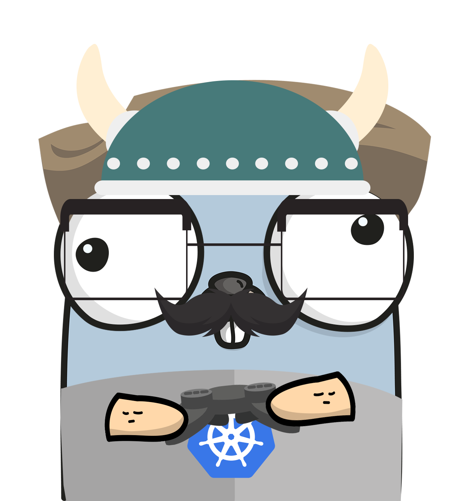

<p align="center">
    
</p>

<h1 align="center" style="text-align: center;">
  Challenge #3. Building an HTTP API
</h1>

In this third challenge we are going to create our HTTP API with Gin, a web framework written in Golang. Furthermore, we
will write our first contract tests to validate the behaviour of the API.

## Instructions

As we mentioned above in the introduction, we will create our first HTTP API to expose the use cases we previously built
to deal with the `Ad` entity. So we are going to need:

* An endpoint to post new ads. This one could be a PUT\POST request (based on who is going to generate the ID, the
requester or the backend) that accepts a JSON payload with the body of the ad. For example:

````http request
PUT http://localhost:8080/ads/b254f816-c92f-4f33-9822-f82b2c3ad6d3
Content-Type: application/json

{
  "title": "Any title",
  "description": "Any description",
  "price": 50
}
````

* An endpoint to retrieve a concrete ad based on its ID. This one could be a simple GET request that includes the id as 
a path param. This endpoint also should return a payload with the Ad info in JSON format. For example:
````http request
GET http://localhost:8080/ads/b254f816-c92f-4f33-9822-f82b2c3ad6d3
````
````json
{
  "id": "b254f816-c92f-4f33-9822-f82b2c3ad6d3",
  "title": "Any title",
  "description": "Any description",
  "price": 50,
  "postedAt": "2023-04-17T16:00:00"
}
````
* An endpoint to retrieve a set of ads (without filters). This one could be a simple GET that fetch a set of ads.
For example:

````http request
GET http://localhost:8080/ads
````
````json
{
  "ads": [
    {
      "id": "b254f816-c92f-4f33-9822-f82b2c3ad6d3",
      "title": "Any title",
      "description": "Any description",
      "price": 50,
      "postedAt": "2023-04-17T16:00:00"
    },
    {
      "id": "c500aa9e-fa70-40cb-bce0-71f5e157c565",
      "title": "Another title",
      "description": "Another description",
      "price": 75,
      "postedAt": "2023-04-15T12:00:00"
    }
  ]
}
````
Be sure to add some **contract tests** to each endpoint to validate their behaviour.


## Resources
1. How to do contract testing with Gin: https://gin-gonic.com/docs/testing/
2. Mocks in Go. Tests with Testify Mock: https://dev.to/salesforceeng/mocks-in-go-tests-with-testify-mock-6pd
